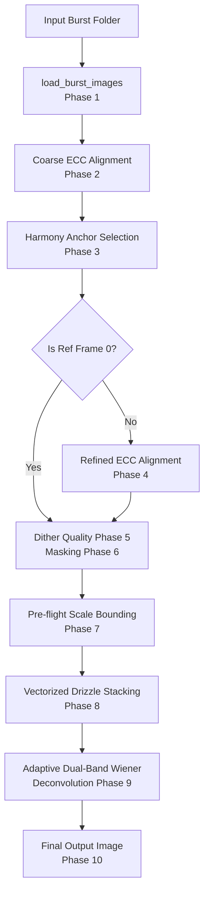

# Optico: System Architecture
**A Mathematically Bounded, Adaptive Multi-Frame Super-Resolution (MFSR) Engine**

This document outlines the system architecture of the Optico backend engine. For the mathematical implementations and physical equations, please refer to [CORE_ALGORITHM.md](CORE_ALGORITHM.md).

---

## Modular Component Overview

Optico's backend has been refactored from a monolithic script into a clean, modular Python package under `backend/`. Each module is designed around a single responsibility in the computational photography pipeline.

```
Optico/
├── backend/
│   ├── __init__.py           # Package initialization & public API exports
│   ├── constants.py          # Centralized configuration & physics-based constants
│   ├── alignment.py          # Registration (ECC, circular statistics & Harmony Anchor)
│   ├── masking.py            # Motion detection & Poisson-Gaussian noise modeling
│   ├── preflight.py          # Sampling theorem & CRLB resolution limits
│   ├── drizzle.py            # Variable-Pixel Linear Reconstruction with memory chunking
│   ├── deconvolution.py      # Spatial-domain blended dual-band Wiener deconvolution
│   └── pipeline.py           # Pipeline runner orchestration & CLI handler
└── requirements.txt          # Declared packages (numpy, opencv-python, scipy)
```

---

## Detailed Pipeline Phases & Component Architecture



### 1. Registration & Anchor Selection (`alignment.py`)
Rather than aligning frames to an arbitrary first frame, Optico utilizes a robust coarse-to-fine anchoring strategy:
* **Initial Pass**: Performs a fast sub-pixel registration of all frames relative to frame 0 using OpenCV's Enhanced Correlation Coefficient (ECC) with translation-only warps to avoid noise overfitting.
* **Harmony Anchor (Phase 3)**: Calculates the **Geometric Median** (using Weiszfeld's algorithm) of the alignment matrices to find the structural center of mass. The sharpest frame (highest Laplacian magnitude) nearest to this median becomes the reference frame.
* **Refined Pass**: Re-aligns the stack to the selected Reference Frame.
* **2D Circular Statistics (Phase 5)**: Measures joint X-Y dither distribution quality using torus resultant vector length $R_{2D} = \sqrt{R_x \cdot R_y}$ to evaluate the uniform spatial coverage of sub-pixel jitter.

### 2. Motion Detection & Noise Modeling (`masking.py`)
To prevent ghosting and motion blur:
* **Noise Modeling**: Computes per-pixel local noise standard deviation $\sigma = \sqrt{aI + b}$ using a Poisson-Gaussian model.
* **Dual-Thresholding**: Normalizes frame differences against local noise and gradients, detecting background motion ($> 1.5\sigma$) and foreground subject motion ($> 3.0\sigma$).
* **Soft Weights**: Applies morphological dilations and Gaussian smoothing to yield smooth weight maps $W \in [0.0, 1.0]$.

### 3. Pre-flight Scale Bounding (`preflight.py`)
To protect against Alignment Drift Blur:
* **Nyquist density cap**: $\text{Limit}_{density} = \sqrt{N \cdot R_{global}}$
* **CRLB blur cap**: $\text{Limit}_{blur} = \alpha \sqrt{\frac{R_{global}}{1 - R_{global}}}$
* **Clamping**: The final scale $S$ is restricted to $\min(\text{Target}, \text{Limit}_{density}, \text{Limit}_{blur})$ to prevent sub-pixel smearing.

### 4. Drizzle Stacking (`drizzle.py`)
* **Vectorized Warp**: Warps each frame and weight map onto the HR grid via `cv2.warpAffine` using scaling translations, achieving $O(N \cdot H \cdot W)$ vectorized efficiency.
* **Active Memory Chunking**: Divides the HR canvas into horizontal strips. Each chunk is processed, normalized, and cast to float32 before the intermediate high-precision accumulators are deleted and `gc.collect()` is called to reclaim memory.

### 5. Deconvolution (`deconvolution.py`)
* **Noise MAD**: Dynamically computes the global noise level $\sigma_{noise}$ using the corrected median absolute deviation (MAD) of the Laplacian: $1.4826 \cdot \text{median}(|\text{Lap}(I) - \text{median}(\text{Lap}(I))|)$.
* **Dual-Band Wiener**: Performs frequency-domain deconvolution using Aggressive ($K_{strong}$) and Conservative ($K_{weak}$) regularizers.
* **Spatial Blending**: Blends the two restored frequency images in the spatial domain using a soft Canny-based edge mask to sharpen flat regions while avoiding edge ringing.
