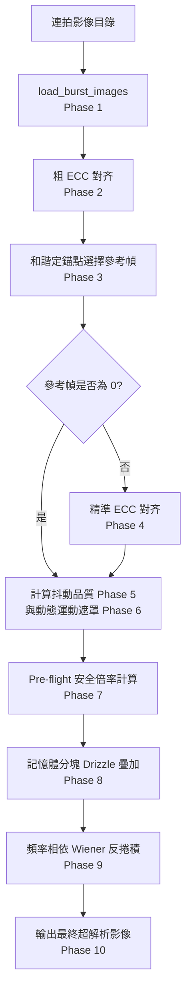

# Optico：系統架構白皮書
**基於數學防護網與自適應反捲積的多幀超解析 (MFSR) 引擎**

本文件旨在說明 Optico 後端引擎的系統架構與模組劃分。關於底層數學推導與物理公式，請參閱 [CORE_ALGORITHM_zh_TW.md](CORE_ALGORITHM_zh_TW.md)。

---

## 模組化組件概覽

Optico 後端已從單一指令碼完全重構為 `backend/` 下的清爽 Python 套件。每個模組皆圍繞計算攝影流程中的單一職責進行設計。

```
Optico/
├── backend/
│   ├── __init__.py           # 套件初始化與公開 API 匯出
│   ├── constants.py          # 集中管理配置參數與光學物理常數 (OpticoConfig)
│   ├── alignment.py          # 影像配准（ECC 對齊、2D 圓統計、和諧定錨點）
│   ├── masking.py            # 運動偵測與泊松-高斯雜訊模型
│   ├── preflight.py          # 奈奎斯特與 CRLB 放大上限計算
│   ├── drizzle.py            # 記憶體條帶分塊的 Variable-Pixel Linear Reconstruction 疊加
│   ├── deconvolution.py      # 頻率相依 Wiener 反捲積，含格柵安全 PSF 上限
│   └── pipeline.py           # Pipeline 流程調度與 CLI 處理器
└── requirements.txt          # 相依套件宣告 (numpy, opencv-python, scipy)
```

---

## 詳細的 Pipeline 階段與組件架構



### 1. 配准與定錨 (`alignment.py`)
為了解決傳統對齊盲目綁定第一幀所產生的偏斜問題，Optico 採用了粗對齊到精定錨的策略：
* **初始對齊**：先以第一幀為基準，透過 OpenCV 的 Enhanced Correlation Coefficient (ECC) 進行亞像素對齊，限制為 `MOTION_TRANSLATION` 模式以防止對雜訊過擬合。
* **和諧定錨 (Harmony Anchor)**：利用 **Weiszfeld 演算法** 尋找所有位移向量的 **幾何中位數 (Geometric Median)** 做為光學重心。接著在重心附近的候選幀中，選擇最清晰者（Laplacian 最高）作為參考幀。
* **精準配准**：若參考幀非第一幀，則將整組連拍重新精準配准至此參考幀。
* **2D 圓統計 (Phase 5)**：將位移向量的小數部分映射至單位環，計算 2D 聯合向量長度 $R_{2D} = \sqrt{R_x \cdot R_y}$，用以評估亞像素手震抖動分佈的均勻性。

### 2. 運動偵測與雜訊模型 (`masking.py`)
為了排除疊加中的動態干擾，避免鬼影與非剛性模糊：
* **雜訊建模**：使用泊松-高斯混合模型 $\sigma = \sqrt{aI + b}$ 計算像素級局部雜訊標準差，使其能適應不同曝光與亮度的區域。
* **雙閾值偵測**：將幀差值除以局部雜訊與邊緣梯度以進行歸一化。檢測背景運動（$> 1.5\sigma$）與主體運動（$> 3.0\sigma$）。
* **軟性遮罩**：經過膨脹與高斯模糊，輸出 $[0.0, 1.0]$ 的連續權重圖，降低硬邊界導致的拼接痕跡。

### 3. Pre-flight 安全倍率計算 (`preflight.py`)
阻絕 Alignment Drift Blur 的防護網：
* **取樣密度限制**：$\text{Limit}_{density} = \sqrt{N \cdot R_{global}}$
* **對齊誤差限制 (CRLB)**：$\text{Limit}_{blur} = \alpha \sqrt{\frac{R_{global}}{1 - R_{global}}}$
* **最終箝制**：將目標倍率 $S$ 箝制在 $\min(\text{Target}, \text{Limit}_{density}, \text{Limit}_{blur})$ 以內，確保只有在對齊品質良好時才允許拉高解析度。

### 4. Drizzle 疊加與快取資料庫 (`drizzle.py`)
* **向量化投影**：利用 `cv2.warpAffine` 將每幀影像與遮罩同步投影至 HR 畫布，時間複雜度為優異的 $O(N \cdot H \cdot W)$。
* **記憶體條帶分塊 (Chunking)**：將超解析畫布水平分割。每個分塊完成累加並除以權重後，強制刪除中間高精度矩陣並呼叫 `gc.collect()` 釋放，使峰值記憶體受控。
* **Drizzle 快取資料庫**：在 Phase 8 之前對輸入影格位元組、解算出的倍率與配置計算 MD5 簽章。若命中快取，管線會完全跳過對齊與 Drizzle 階段（Phase 2-8），直接自硬碟載入已疊加好的高精度 Drizzle 畫布。
* **核心選擇**：`kernel_mode`（預設 **`lanczos4`**，2026-07 變更）決定累加核心。`lanczos4` 搭配格柵安全 PSF 上限在振鈴、格柵週期性、leave-one-out 保真度上表現最優。

### 5. 專用鏡頭反捲積 (`deconvolution.py`)
* **物理焦距 PSF 定錨**：為了避免在 JPEG 感光底噪上進行不穩定的噪訊-對比估計（相機內建 JPEG 降噪會大幅扭曲雜訊估算，導致錯判），Optico 將 Wiener `psf_base` 物理參數與鏡頭焦段直接對應：
  * **焦距 <= 28mm (17mm 超廣角，小人臉)** $\to$ $\text{psf\_base} = 0.35$（溫和對焦，避免小人臉五官因去模糊過強而扭曲或產生粗顆粒）。
  * **焦距 = 45mm** $\to$ $\text{psf\_base} = 0.57$（中焦平衡）。
  * **焦距 = 50mm (50mm 中長焦，人臉大)** $\to$ $\text{psf\_base} = 0.63$（極致銳化，發揮最高解像力）。
* **頻率相依 Wiener**：直接從影像自身功率頻譜以平台偵測估計逐頻率正則化映射 $K(f)$。此法直接對應教科書 SNR-inverse Wiener 解，相較舊版雙頻段方案平均提升 PSNR +1.54 dB。
* **格柵安全 PSF 上限**：將自動估計的 PSF sigma 上限箝制，避免 Wiener 濾波器的通帶觸及 Drizzle 核心殘留的格柵瑕疵頻率。
* **邊緣錐化**：FFT2 前對影像邊界套用餘弦漸變窗，抑制原本會貫穿人臉等平滑區域的頻譜洩漏橫帶。
* **魯棒邊緣箝制**：針對 JPEG 影像，在高對比邊緣（如天際線、欄杆）利用局部鄰域最大最小值進行箝制，防止高頻振鈴被放大，同時保持平滑的線性邊緣梯度。

